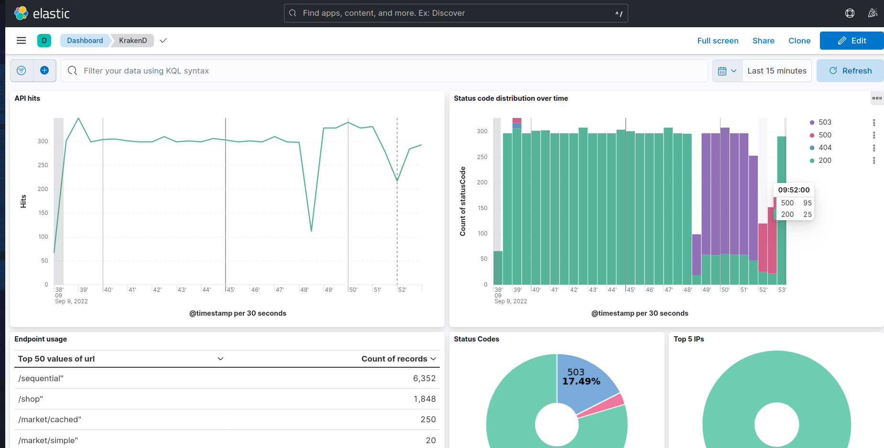

ELK Dashboard for KrakenD
===========================
This repository contains **example configurations** to support an Elastic + Logstash + Kibana (ELK) installation. It includes a Logstash configuration that parses and ingests KrakenD logs for KrakenD Enterprise and KrakenD Community Edition.

It also includes two Kibana dashboards, one for the **Access Log** activity and another for the **Application Log** activity.

By using the configurations included here, you will have KrakenD configured for ELK.



## Logstash
The `logstash.conf` file includes an example of a Logstash configuration. First, change the **hostname** of your Elasticsearch server and any custom ports you might use. Then, start Logstash with this configuration to properly ingest KrakenD logs.

## Kibana
To import the Kibana dashboard included in this repository, execute the following command **once your Kibana is up and running**. Replace `localhost:5601` if needed:

```shell
curl -X POST "localhost:5601/api/saved_objects/_import" -H "kbn-xsrf: true" --form file=@dashboard.ndjson -H "kbn-xsrf: true"
```

## KrakenD configuration
On your `krakend.json`, ensure to include the `telemetry/logging` and `telemetry/gelf` components as shown below. Also, make sure the GELF address is correct.

```json
{
  "$id": "https://www.krakend.io/schema/v3.json",
  "version": 3,
  "extra_config": {
    "telemetry/logging": {
      "level": "DEBUG",
      "@comment": "Prefix should always be inside [] to keep the grok expression working"
      "prefix": "[KRAKEND]",
      "syslog": false,
      "stdout": true
    },
    "telemetry/gelf": {
      "address": "logstash:12201",
      "enable_tcp": false
    }
  }
}
```

## Contribute!
In this repository, you have an example of the ingestion process and dashboard visualization, and you can improve it in many ways.

Try it out! If it doesn't help you, or you think you can add additional metrics or improvements, please open a pull request!

Thanks!

---

If you have any questions or doubts, you can find our support resources at [https://www.krakend.io/support/](https://www.krakend.io/support/)
